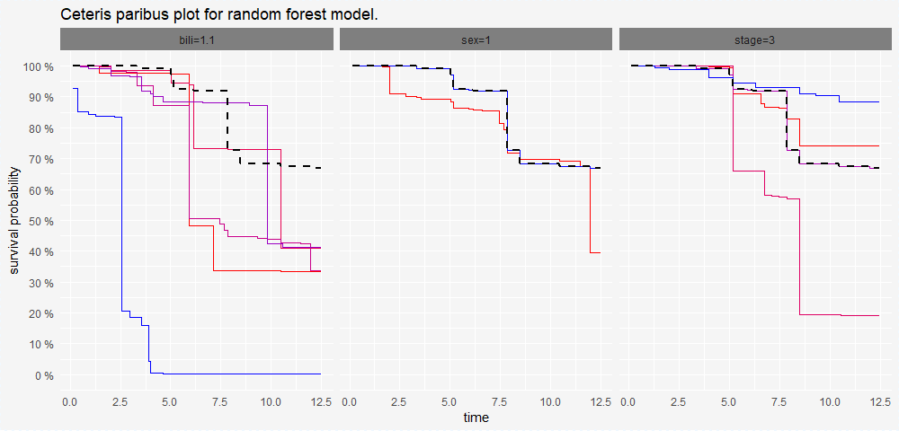
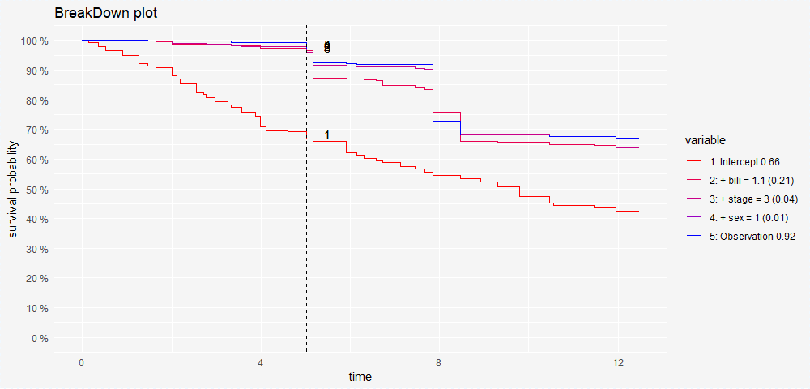

# Introduction

<!-- A summary describing the high-level functionality and purpose of the software for a diverse, non-specialist audience-->

Predictive models are widely used in the supervised machine learning. Three most common classes of such models are: *regression models*, here the target variable is continuous numeric, *classification models* here the target variable is binary or categorical and *survival models* here the target is some censored variable. Common examples of censored variables are time to death (but some cases lived for x years and are still alive), cessation of service by the customer or failure of a machine component.

Modern predictive models are often complex in structure. Think about neural networks [@ELEUTERI2003855] or random forest [@randomForestSRC]. Such models may be described by thousands of coefficients. Often such flexibility leads to high performance, but makes these models opaque, hard to understand. It is acceptable in cases in which only the model accuracy is important, but in cases that involve human decisions it may not be enough. To trust model predictions one needs to see which features are important and how model predictions would change if some feature was changed. 

The area of model interpretability or explanability gains quickly attention of machine learning experts. Understanding of complex models leads not only to higher trust in model predictions but also to better models. Better means that they are more robust and maintain high accuracy on validation data. See examples in `DALEX`  [@2018arXiv180608915B] or `iml` [@Molnar2018] R packages. 

Existing tools for model agnostic explanations are focused on regression models and classification problems as in both cases model predictions may be summarised by a single number. Survival models require different approach as predictions are in a form of survival curves. Demand for such explainers leads to some model specific solutions, like `iSurvive` introduced by [@pmlr-v70-dempsey17a] for continuous time hidden Markov model. Yet, we are lacking of model agnostic tools for survival models.

The `survxai` fills out this gap. This R package is designed to deliver local and global explanations for survival models in a model agnostic fashion. In the package documentation we demonstrate examples for Cox models and for Survival Random Forest models.
The `survxai` package consists new implementations and visualisations of explainers designed for survival models. Functions are well documented, package is supplemented with unit tests and illustrations. 
Regardless of the complexity of the model, methods implemented in the `survxai` package maintain a certain level of interpretability, important in medical applications [@collett2015modelling], churn analysis [@lu2003modeling] and others.

<!-- A clear statement of need that illustrates the purpose of the software-->
# Explanations of survival models
 
The R package `survxai` is a tool for creating explanations of survival models. It's model agnostic, thus is working with both complex and simple survival models. It also allows to compare two or more models. 
 
Currently, four classes of model explainers are implemented. Two for local explanations (for a single prediction), and two for global explanations (for a whole model). 

Package `survxai` is available on CRAN and a development version of the package can be found on [https://github.com/MI2DataLab/survxai](https://github.com/MI2DataLab/survxai).

**Local methods** are the explanations of one observation.
 
- **Ceteris Paribus** plot presents model responses around a single point in the feature space [@ceterisParibus]. See an example in Figure 1. Each panel is related to a single variable. Single panel shows how a model prediction (survival curve) would change if only a single variable will be changed. It if usefull for *what-if* reasoning. Each curve in a panle is realted a different value of the selected variable.
Ceteris Paribus plot illustrates how may the survival curve change along with the changing values of the variable. 

- **break down** plot presents variable contributions in final predictions  [@2018arXiv180401955S]. See an example in Figure 2. The Break Down of prediction  for survival model helps to understand which factors drive survival probability for a single observation.

 
**Global methods** are model performance and explanations of the conditional model structure.
 
- **variable response** plot is designed to better understand the relation between a variable and a model output. See an example in Figure 3. Variable response plot illustrates how the mean survival curve change along with the changing values of the variable. It is inspired by partial dependence plots [@RJ-2017-016]. 

 
- **model performance** curves present prediction error for the chosen survival model depending on time. See an example in Figure 4. For computing prediction error we use the expected Brier Score [@BSScore]. At a given time point t, the Brier score for a single observation is the squared difference between observed survival status and a model-based prediction of surviving time t.

<!-- Mentions (if applicable) of any ongoing research projects using the software or recent scholarly publications enabled by it -->

# Conclusions and future work

Explainers implemented in the `survxai` package allow exploring one or more models in a feature-by-feature fashion. This approach will miss interactions between variables that may be handled by the models. The main problem with integrations is that number of interactions grows rapidly with the number of features what makes it hard to present in a readable form. 

# Acknowledgments

The work was supported by NCN Opus grant 2016/21/B/ST6/02176.

<!-- A list of key references including a link to the software archive -->

# References

